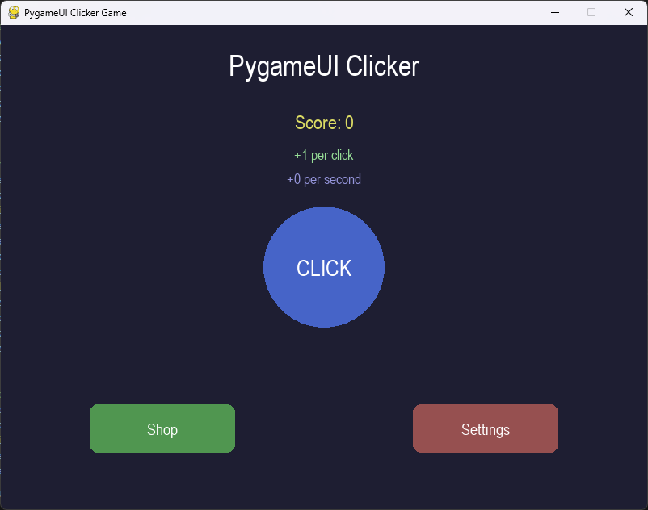

# Simple Game Example

This example demonstrates how to create a complete clicker game using multiple PygameUI components working together in a cohesive application.



## Features Demonstrated

- **Multiple screens**: Main game, shop, and settings screens
- **State management**: Tracking game state across different screens
- **Complex UI interactions**: Handling multiple interactive elements together
- **Dialog windows**: Creating confirmation dialogs
- **Theme switching**: Changing the UI appearance dynamically
- **Animation effects**: Adding visual feedback to user actions
- **Helper functions**: Using functions to organize UI logic for cleaner code

## Application Structure

The game is organized into three main screens:

1. **Main Screen**: Game title, score display, clicker button, navigation buttons
2. **Shop Screen**: Upgrades that can be purchased with points
3. **Settings Screen**: Theme selection and game reset options

## Code Organization

The code follows this organization pattern:
```
1. Initialization
2. Component Definition (by screen)
3. Game Loop with:
   - Event handling
   - Update phase (components)
   - Draw phase (components)
   - Screen-specific logic
```

## Key Implementation Concepts

### Screen Management

The example uses a simple screen management system with a state variable:

```python
# UI State
current_screen = "main"  # "main", "shop", "settings"

# In the game loop
if current_screen == "main":
    # Update and draw main screen elements
elif current_screen == "shop":
    # Update and draw shop screen elements
elif current_screen == "settings":
    # Update and draw settings screen elements
```

### Game State Management

The game keeps track of the player's progress in a dictionary:

```python
# Game state
game_state = {
    "score": 0,
    "click_value": 1,
    "passive_income": 0,
    "last_tick": time.time(),
    "background_color": (30, 30, 50)
}
```

### Shop Implementation

The shop uses a data-driven approach for upgrades:

```python
# Shop items
shop_items = [
    {
        "name": "Better Clicker",
        "description": "Increases click value by 1",
        "cost": 10,
        "effect": lambda state: state.update(click_value=state["click_value"] + 1),
        "button": pygameui.Button(...)
    },
    # More items...
]
```

### Theme Switching

The settings screen implements theme switching with a dropdown menu:

```python
theme_options = ["Dark Blue", "Dark Gray", "Dark Purple", "Dark Green"]
theme_colors = {
    "Dark Blue": (30, 30, 50),
    "Dark Gray": (40, 40, 40),
    "Dark Purple": (40, 30, 50),
    "Dark Green": (30, 50, 30)
}

# In the update loop:
selected_theme = theme_dropdown.get_selected_option()
if selected_theme in theme_colors:
    game_state["background_color"] = theme_colors[selected_theme]
```

### Dialog Implementation

The confirmation dialog is implemented using layered components:

```python
# Reset confirmation dialog
reset_confirm_bg = pygameui.Element(...)  # Background
reset_confirm_text = pygameui.Text(...)   # Message
reset_confirm_yes = pygameui.Button(...)  # Confirm button
reset_confirm_no = pygameui.Button(...)   # Cancel button

# In the game loop, when dialog should show:
reset_confirm_bg.draw(screen)
reset_confirm_text.draw(screen)
reset_confirm_yes.draw(screen)
reset_confirm_no.draw(screen)
```

## Animation Effects

The game adds simple animation when the user clicks the main button:

```python
if clicker_button.was_clicked():
    game_state["score"] += game_state["click_value"]
    # Add a little animation
    clicker_button.flow(
        start_position=clicker_button.get_position(),
        end_position=(clicker_button.get_position()[0], clicker_button.get_position()[1] + 10),
        time=100,
        loop=False
    )
    clicker_button.set_animate(True)
```

## Best Practices Demonstrated

1. **Component Organization**: Organizing UI components by screen/functionality
2. **State Management**: Maintaining game state separately from UI components
3. **Consistent Styling**: Using similar colors and styling for related elements
4. **User Feedback**: Providing visual feedback for user actions
5. **Modular Design**: Using dictionaries and data structures for scalable content
6. **Proper Event Handling**: Passing events to all active components
7. **Dialog Layering**: Creating proper Z-ordering for overlapping elements

## Full Example Code

See the complete [simple_game.py](https://github.com/trymbf/pygameui/blob/main/examples/simple_game.py) file in the examples directory.