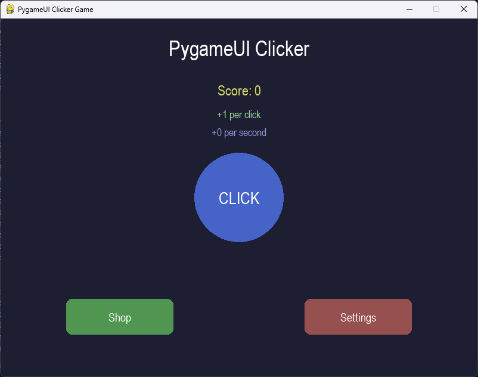

# Examples

This section contains detailed examples demonstrating how to use PygameUI components to build interactive interfaces.

## Available Examples

Each example demonstrates different aspects of the PygameUI library:

### [Button Example](button.md)

Learn how to create and customize buttons with different styles and handle user interactions.

- **Key concepts**: Button styling, event handling, click detection
- **Components used**: Button, Text
- **Source code**: [button_example.py](https://github.com/trymbf/pygameui/blob/main/examples/button_example.py)

### [Input Form Example](form.md)

A complete registration form with validation, demonstrating how to build forms with PygameUI.

- **Key concepts**: Form validation, checkboxes, input filtering
- **Components used**: Input, Text, Checkbox, Button
- **Source code**: [input_form_example.py](https://github.com/trymbf/pygameui/blob/main/examples/input_form_example.py)

### [Animation Demo](animation.md)

Explore PygameUI's animation capabilities with flow and jump animations, plus custom animation techniques.

- **Key concepts**: Flow animation, jump animation, custom motion
- **Components used**: Element, Text
- **Source code**: [animation_demo.py](https://github.com/trymbf/pygameui/blob/main/examples/animation_demo.py)

### [Simple Game](game.md)

A complete clicker game with multiple screens, shop system, and settings - showcasing how to build a full application.

- **Key concepts**: Multiple screens, state management, dialog windows, theming
- **Components used**: Button, Text, DropdownMenu, Element
- **Source code**: [simple_game.py](https://github.com/trymbf/pygameui/blob/main/examples/simple_game.py)

## Running the Examples

To run any example:

1. Make sure you have both Pygame and PygameUI installed
2. Download the example file or copy the code from the documentation
3. Run it with Python: `python example_filename.py`

## Creating Your Own Examples

When creating your own examples, remember these key principles:

1. Always get events and pass them to the update method of UI components
2. Draw components after updating them
3. Use consistent styling for a cohesive UI
4. Organize your code with clear sections for initialization, update, and drawing