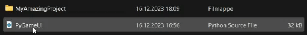

# Getting Started with PygameUI

## Installation

1. Start by downloading the latest PygameUI Python file from the [releases page](https://github.com/trymbf/pygameui/releases).

2. Place the `pygameui.py` file in the same folder as your project files.


3. Import the library in your project:
```python
import pygame
import pygameui
```

## Basic Structure

Every PygameUI application follows this basic structure:

```python
import pygame
import pygameui

# Initialize
pygame.init()
screen = pygame.display.set_mode((800, 600)) # Set your own width and height

# Create UI elements
ui_element = pygameui.Element(
    position=(250, 250),  # x, y coordinates
    width=200,
    height=50
)

# Control framerate
clock = pygame.time.Clock()

# Main loop
running = True
while running:
    # Handle events
    events = pygame.event.get()
    for event in events:
        if event.type == pygame.QUIT:
            running = False

    # Reset screen
    screen.fill((0, 0, 0))  # Black background
  
    # Update element, moves, checks actions etc
    ui_element.update(events)  # Pass events to the update method

    # Draw element on screen
    ui_element.draw(screen)

    # Update pygame display
    pygame.display.flip()

    # Run at 60 frames per second
    clock.tick(60)
```

## Example: Creating Text

First create a text object:

```python
my_text = pygameui.Text(
    position=(100, 100),
    content="Hello World", 
    font_size=30, 
    color=(255, 255, 255)  # White color
)
```

And then in the main loop, call:

```python
# Pass events to update method for UI elements that need them
my_text.update(events)
my_text.draw(screen)
```

That's it! You now have a text object on your screen. You can customize the text by changing its properties like `font_size`, `color`, and `position`. [See the Text class documentation for more details.](components/text.md)

## Creating Interactive Elements

For interactive elements like buttons or inputs, you need to pass the events list to the update method:

```python
# Create a button
my_button = pygameui.Button(
    position=(400, 300),
    width=200,
    height=50,
    label="Click Me!",
    color=(100, 100, 255)  # Light blue color
)

# In the main loop
my_button.update(events)
my_button.draw(screen)

# Check if button was clicked
if my_button.was_clicked():
    print("Button was clicked!")
```

## Animation

PygameUI makes it easy to animate UI elements:

```python
# Set up a button that flows back and forth
animated_button = pygameui.Button(
    position=(400, 200),
    width=200,
    height=50,
    label="Animated Button"
)

# Create a flowing animation between two positions
animated_button.flow(
    start_position=(200, 200),
    end_position=(600, 200),
    time=1000,  # 1000ms (1 second)
    loop=True   # Loop the animation continuously
)

# Enable animation
animated_button.set_animate(True)
```

To add more UI elements, simply create more instances of the appropriate classes and follow the same pattern. See the specific component documentation pages for details on each element type.

## Next Steps
- [Explore more components](components/index.md) to see what PygameUI can do.
- [Check out the examples](../examples/) to see PygameUI in action.
- [Read the API documentation](../api/) for detailed information on each class and method.
