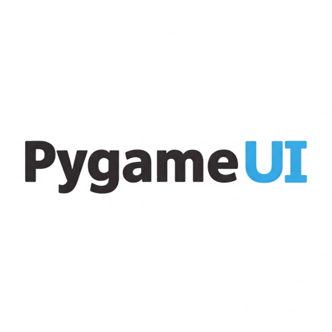
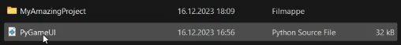

# PyGameUI

A lightweight Python library that makes creating UI elements in Pygame quick and easy.

## Short overview

`PygameUI` is a small Python library written in Python that makes it easier to create UI elements like buttons, texts, inputs, and more when using the Python library PyGame. The library also supplies the user with many optional features for customizing the UI elements.

(Hint: Feel free to ⭐star⭐ the repo on [github](https://github.com/trymbf/pygameui)!)

## Documentation

Documentation in web form is available at [https://trymbf.github.io/pygameui/](https://trymbf.github.io/pygameui/)

Documentation in markdown form is available in the `docs` folder of the repository.   

You can also download the documentation as a PDF file from the [releases page](https://github.com/trymbf/pygameui/releases)

## Installation

Start by downloading the PyGameUI python file from the [releases page](https://github.com/trymbf/pygameui/releases).

Then place the PyGameUI file in the same folder as your project files.

(See the [getting started guide](getting-started.md) for more details)

## Available Elements

- **Element**
  The base class for all UI elements. It provides basic functionality such as setting position, drawing, and updating. [Learn more!](components/element.md)
- **Text**
  A class for displaying text. It extends the `Element` class and adds text-specific attributes and methods. [Learn more!](components/text.md)
- **Image**
  A class for displaying images. It extends the `Element` class and adds image-specific attributes and methods. [Learn more!](components/image.md)
- **Input**
  A class for creating input fields. It extends the `Text` class and adds input-specific attributes and methods. [Learn more!](components/input.md)
- **Button**
  A class for creating buttons. It extends the `Element` class and adds button-specific attributes and methods. [Learn more!](components/button.md)
- **DropDownMenu**
  A class for creating dropdown menus. It extends the `Element` class and adds dropdown-specific attributes and methods. [Learn more!](components/dropdown-menu.md)
- **CheckBox**
  A class for creating checkboxes. It extends the `Element` class and adds checkbox-specific attributes and methods. [Learn more!](components/checkbox.md)
- **Table**
  A class for creating tables. It extends the `Element` class and adds table-specific attributes and methods. [Learn more!](components/table.md)
- **ProgressBar**
  A class for creating progress bars. It extends the `Element` class and adds progress bar-specific attributes and methods. [Learn more!](components/progress-bar.md)

## Getting Help

- [GitHub Issues](https://github.com/trymbf/pygameui/issues)

## Current Version

The current version of PygameUI is **2.2.1**.

## License

PygameUI is open-source software.
